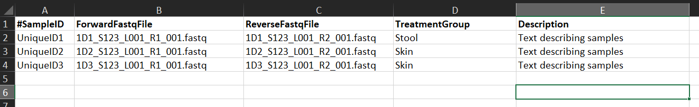

\ 
\ 

# Steps
1. Prepare the sample
2. Sequence
3. Pre-process the data
4. Analyze the data
5. Explore the data further
\ 
\ 

# 3. Pre-process the data
\ 
\ 

### Input Data

Nephele v2 supports demultiplexed paired-end and single-end FASTQ files.
\ 
\ 

### Demultiplex

### Quality check
Nephele provides a pre-processing quality check pipeline for demultiplexed paired-end and single-end FASTQ files.The Nephele QC pipeline can run a quality control check (FastQC), Trim primers and/or adapters, Trim and/or Filter reads based on quality scores, Merge read pairs, and provides summary graphs of the QC steps Learn more

#### 1. FastQC
**FastQC** is always run first in the pipeline with default parameters. **FastQC** analyzes the input FASTQ files and reports summary statistics about each file in both tabular and graphical format, including number of reads, average per base quality score, etc. Nephele uses FastQC v0.11.7.

#### 2. Adapter/Primer trimming
Adapter and/or primer trimming is optional. Nephele uses the **cutadapt** plugin from QIIME 2 version 2018.6 for primer and adapter trimming. cutadapt trims the sequences specified by the user from either the 5' or 3' ends of reads. To trim primers for amplicon sequence data, the primer sequence should be specified as the Forward and/or Reverse front 5' adapter.

Options include specifying the 3' and 5' adapter sequences. Partial matches can be made at the 5' end. Can change the maximum allowed error rate, can include Indels (allow insertions or deletions of bases), allow adapter overlap (requires this many bases of overlap between read and adapter for an adapter to be found), and can interperate IUPAC wildcards (e.g. N) in the adapter or reads.

#### 3. Quality trimming
Quality trimming is optional. **Trimmomatic** v0.38 is used for quality trimming. Trimmomatic uses a sliding window from the 5' to the 3' end of the read. When the average quality in the window drops below the required quality score, the read is trimmed to remove the 3' low quality end of the read.
Poor quality sequence can also be trimmed at the start of a read using the Leading quality trim option.

Options include changing the Window size, required quality, Minimum length (removes them if below), Average quality level.

#### 4. Paired-end read merging
Read merging is only for paired-end data sets and is optional. For merging read pairs, Nephele uses **FLASH2** v2.2.00. FLASH is designed to merge pairs of reads when the original fragment length is shorter than twice the length of reads. It merges read pairs if the rate of mismatches in the overlapping region is less than the user-specified Maximum mismatch density. 

Can set options for the Minimum and Maximum overlap between two reads to provide a confident overlap. Can also set maximum mismatch density (Maximum allowed ratio between number of mismatched base pairs and the overlap length (default:0.25)

#### 5. Summary graphs
Summary graphs are always made as the final step of the pipeline. Nephele uses **MultiQC** v1.8dev.
**MultiQC** summarizes the output of FastQC, cutadapt, Trimmomatic, and FLASh (if any of those steps are chosen by the user) and produces a single html report with graphs.

# 4. Analyze the data

### Mapping File Template

INSTRUCTIONS for mapping file required by QIIME, mothur, or DADA2 Demultiplexed* pipelines.

There should not be spaces anywhere in your mapping file except for the Description. 
You can use a comma separated file, a tab-delimited (.txt) file, OR an Excel (.xlsx, .xls, not Strict) file in this format.

Column A (#SampleID): Use unique ID.  Use only alphanumeric characters and period (.) 

Column B (ForwardFastqFIle): Add file name of forward read FASTQ file for each sample. Enter the exact file name the same, including extensions (i.e. .gz or .tar.gz)

Column C (ReverseFastqFile): Add file name of reverse read FASTQ file for each sample. Enter the exact file name the same, including extensions(i.e. .gz or .tar.gz)

Column D (TreatmentGroup): Add metadata values here. You must have at least two different values. (see Note below). CANNOT be left blank

Column E (Description): Add keywords to describe the samples.  Spaces are ok.

Note: If desired, add additional metadata columns (e.g. tissue, time) between columns labeled with "TreatmentGroup" and "Description". Each additional metadata column must have at least two different terms.  NO spaces allowed. For example, if you add an additional column with header "Time", some samples could have "time0" and other samples could have "time1" but not all samples can be "time0"  or "time1".  

*Demutiplexed FASTQ file pairs do not contain barcode and linker sequences therefore it is not necessary to add these sequences to this template.

### DADA2

The DADA2 pipeline accepts amplicon single or paired-end FASTQ data, and outputs sequence variants, their sample-wise abundances after removing substitution and chimera errors, and summary plots.

### QIIME2 (NEW)

The QIIME 2.0 16S pipeline starts with FASTQ data and finishes with a rarefaction plot, taxonomy barplot and a biom file that can be further explored using the Downstream Analysis pipeline. It relies on VSEARCH for De novo, Open and Closed reference clustering into OTUs. For Single-End data, it also provides the DEBLUR denoising algorithm.

### BioBakery 
Pipeline for metagenome shotgun data. 

# 5. Explore the data further

### Downstream analysis
You can use biom files from your 16S or ITS pipeline outputs to run the downstream analysis (DA) pipeline. Nephele's DA pipeline uses QIIME 2 to provide sample observation and taxonomic summaries and diversity analyses of an OTU table.

# Sources

https://nephele.niaid.nih.gov/index