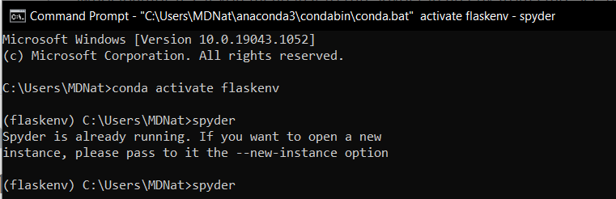

Make Conda is in your path by running `Conda -V` from the command line.

If it doesn't return your version number, add the location of your installed Anaconda installation and the 'Scripts' folder to your PATH.

Mine was in `C:\Users\MDNat\anaconda3` and `C:\Users\MDNat\anaconda3\Scipts`

To create the Virutal Environment, use the Anaconda Navigator and on the left side, click 'Environments'. At the bottom, click create, specify the version of Python, give it a name, and click 'Create'.

On the left, click 'Home' and under 'Spyder' click 'Install'. When it's done, click 'Launch'.

To activate the virtual environment from the command prompt, type `conda activate <virutalEnvName>`

To launch Spyder, type `spyder`

