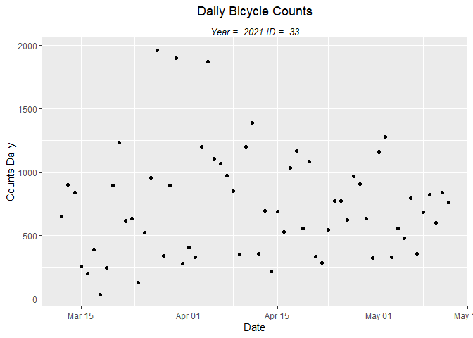

Picking a Bikometer
================

# Goal

Determine which Bikeometers to include in our visualization. Bikeometers
will be excluded if they are missing data in the time range we are
exploring. Bikeometers were also excluded if they were not in the
Arlington region.

# Import the table

We will start by importing the necessary packages and establishing a
connection to the database.

Next, we can use the dplyr function tbl(), pass in the connection object
*con* and the name of the table we want to look at ‘counts\_daily’. This
will create a ‘lazy table’, importing only the first 10 rows. You can
tell the entire table has not been imported because instead of listing
the number of rows, it lists: ‘Source: table<counts_daily> \[?? x 9\]’

``` r
# Imports to a lazy table
counts_daily <- tbl(con, 'counts_daily')
counts_daily
```

    ## Warning in `*.integer64`((x[equal] - y[equal]), 2^-l2x[equal]): NAs produced by
    ## integer64 overflow

    ## # Source:   table<counts_daily> [?? x 9]
    ## # Database: mysql [root@:/bikeometers_db]
    ##    bikeometer_id date       direction   count is_weekend    year   month     day
    ##            <int> <date>     <chr>     <int64>    <int64> <int64> <int64> <int64>
    ##  1             3 2010-12-08 I              16          0    2010      12       8
    ##  2             3 2010-12-08 O              96          0    2010      12       8
    ##  3             3 2010-12-09 I             297          0    2010      12       9
    ##  4             3 2010-12-09 O             135          0    2010      12       9
    ##  5             3 2010-12-10 I             189          0    2010      12      10
    ##  6             3 2010-12-10 O             157          0    2010      12      10
    ##  7             3 2010-12-11 I             164          1    2010      12      11
    ##  8             3 2010-12-11 O             122          1    2010      12      11
    ##  9             3 2010-12-12 I              15          1    2010      12      12
    ## 10             3 2010-12-12 O              18          1    2010      12      12
    ## # ... with more rows, and 1 more variable: month_day <chr>

The MnDOT combines directions ‘I’ and ‘O’ together so let’s do that now.

# Combine I and O values

In order to create our new ‘combined’ table, we want ‘date = 2010-12-08,
bikeometer\_id=3, direction=I’ combined with ‘date = 2010-12-08,
bikeometer\_id=3, direction=O’. In order to do this, we will need to
group our observations not only by date, but also by bikeometer\_id.
Remember, there are many observations with date=2010-12-08 as each
Bikeometer may have data for that date.

We will pipe our counts\_daily table into the group\_by() and
summarize() functions found in the *dplyr* package. To combine the ‘I’
and ‘O’ counts we will use the function sum() then just specify the
other variables we want to include in our new *counts\_daily\_total*
table.

``` r
counts_daily_total <- counts_daily %>% 
  group_by(date, bikeometer_id) %>% 
  summarize(count = sum(count), is_weekend = is_weekend, 
            month = month, day = day, year = year, month_day = month_day) %>% 
  collect()
```

    ## Warning: Missing values are always removed in SQL.
    ## Use `SUM(x, na.rm = TRUE)` to silence this warning
    ## This warning is displayed only once per session.

    ## `summarise()` has grouped output by 'date'. You can override using the `.groups` argument.

``` r
counts_daily_total
```

    ## Warning in `*.integer64`((x[equal] - y[equal]), 2^-l2x[equal]): NAs produced by
    ## integer64 overflow

    ## # A tibble: 85,793 x 8
    ## # Groups:   date [4,039]
    ##    date       bikeometer_id count is_weekend   month     day    year month_day
    ##    <date>             <int> <dbl>    <int64> <int64> <int64> <int64> <chr>    
    ##  1 2010-12-08             3   112          0      12       8    2010 12_8     
    ##  2 2010-12-09             3   432          0      12       9    2010 12_9     
    ##  3 2010-12-10             3   346          0      12      10    2010 12_10    
    ##  4 2010-12-11             3   286          1      12      11    2010 12_11    
    ##  5 2010-12-12             3    33          1      12      12    2010 12_12    
    ##  6 2010-12-13             3   195          0      12      13    2010 12_13    
    ##  7 2010-12-14             3   183          0      12      14    2010 12_14    
    ##  8 2010-12-15             3   187          0      12      15    2010 12_15    
    ##  9 2010-12-16             3    96          0      12      16    2010 12_16    
    ## 10 2010-12-17             3    29          0      12      17    2010 12_17    
    ## # ... with 85,783 more rows

To do a quick check, we can add the ‘I’ and ‘O’ values for
bikeometer\_id=3, date=2010-12-08 (16+96=112). Looking at our new table,
we can look at the first observation to see that it worked.

Even though it isn’t mentioned in the Bike Arlington documentation, it’s
important to account for the ‘A’ direction. When the Bikeometer can’t
distinguish between outbound and inbound directions, the direction is
classified as ‘A’.

Let’s use Bikeometer 14 as an example and check to make sure our ‘A’
*counts* have been properly moved over to our table.

``` r
counts_daily_a <- counts_daily_total %>% filter(bikeometer_id == '14') %>% collect()
counts_daily_a
```

    ## Warning in `*.integer64`((x[equal] - y[equal]), 2^-l2x[equal]): NAs produced by
    ## integer64 overflow

    ## # A tibble: 2,594 x 8
    ## # Groups:   date [2,594]
    ##    date       bikeometer_id count is_weekend   month     day    year month_day
    ##    <date>             <int> <dbl>    <int64> <int64> <int64> <int64> <chr>    
    ##  1 2012-12-04            14    73          0      12       4    2012 12_4     
    ##  2 2012-12-05            14   105          0      12       5    2012 12_5     
    ##  3 2012-12-06            14    84          0      12       6    2012 12_6     
    ##  4 2012-12-07            14    59          0      12       7    2012 12_7     
    ##  5 2012-12-08            14    96          1      12       8    2012 12_8     
    ##  6 2012-12-09            14    42          1      12       9    2012 12_9     
    ##  7 2012-12-10            14   104          0      12      10    2012 12_10    
    ##  8 2012-12-11            14    91          0      12      11    2012 12_11    
    ##  9 2012-12-12            14    78          0      12      12    2012 12_12    
    ## 10 2012-12-13            14   114          0      12      13    2012 12_13    
    ## # ... with 2,584 more rows

Next, we will confirm that these counts match the counts in the original
*counts\_daily* table.

``` r
counts_daily_a <- counts_daily %>% filter(bikeometer_id == '14') %>% collect()
counts_daily_a
```

    ## Warning in `*.integer64`((x[equal] - y[equal]), 2^-l2x[equal]): NAs produced by
    ## integer64 overflow

    ## # A tibble: 2,601 x 9
    ##    bikeometer_id date       direction   count is_weekend    year   month     day
    ##            <int> <date>     <chr>     <int64>    <int64> <int64> <int64> <int64>
    ##  1            14 2012-12-04 A              73          0    2012      12       4
    ##  2            14 2012-12-05 A             105          0    2012      12       5
    ##  3            14 2012-12-06 A              84          0    2012      12       6
    ##  4            14 2012-12-07 A              59          0    2012      12       7
    ##  5            14 2012-12-08 A              96          1    2012      12       8
    ##  6            14 2012-12-09 A              42          1    2012      12       9
    ##  7            14 2012-12-10 A             104          0    2012      12      10
    ##  8            14 2012-12-11 A              91          0    2012      12      11
    ##  9            14 2012-12-12 A              78          0    2012      12      12
    ## 10            14 2012-12-13 A             114          0    2012      12      13
    ## # ... with 2,591 more rows, and 1 more variable: month_day <chr>

The only difference is that we lost the *direction* variable in our
*counts\_daily\_total* table which we don’t need anymore.

# Creating the inital visualizations

This is where our hard work will start to pay off. Let’s use the date’s
we chose in Part 1 (March 12 - May 15), pick a Bikeometer (28), and
create a graph.

First, we will filter our data. We will pipe our *counts\_daily\_total*
table into the *dplyr:filter* function to subset rows using column
values.

``` r
counts_daily_filtered <- counts_daily_total %>% 
  filter(date >= '2017-03-12' & date <= '2017-05-15' & bikeometer_id == '28'| 
         date >= '2018-03-12' & date <= '2018-05-15' & bikeometer_id == '28'|
         date >= '2019-03-12' & date <= '2019-05-15' & bikeometer_id == '28'| 
         date >= '2020-03-12' & date <= '2020-05-15' & bikeometer_id == '28') %>%
  print()
```

    ## Warning in `*.integer64`((x[equal] - y[equal]), 2^-l2x[equal]): NAs produced by
    ## integer64 overflow

    ## # A tibble: 260 x 8
    ## # Groups:   date [260]
    ##    date       bikeometer_id count is_weekend   month     day    year month_day
    ##    <date>             <int> <dbl>    <int64> <int64> <int64> <int64> <chr>    
    ##  1 2017-03-12            28   201          1       3      12    2017 3_12     
    ##  2 2017-03-13            28   634          0       3      13    2017 3_13     
    ##  3 2017-03-14            28    36          0       3      14    2017 3_14     
    ##  4 2017-03-15            28   105          0       3      15    2017 3_15     
    ##  5 2017-03-16            28   253          0       3      16    2017 3_16     
    ##  6 2017-03-17            28   372          0       3      17    2017 3_17     
    ##  7 2017-03-18            28   453          1       3      18    2017 3_18     
    ##  8 2017-03-19            28   299          1       3      19    2017 3_19     
    ##  9 2017-03-20            28  1006          0       3      20    2017 3_20     
    ## 10 2017-03-21            28  1181          0       3      21    2017 3_21     
    ## # ... with 250 more rows

Another way to do this is to use the **dbGetQuery()** function in the
*DBI* package. We can pass in the MySQL SELECT statement directly to the
dbGetQuery() function along with the connection object to return our
desired table.

Using head(my\_table), I was able to view the top 6 rows of
my\_filtered\_table directly in R.

``` r
sql_cmd <- "SELECT * FROM bikeometers_db.counts_daily WHERE bikeometer_id = 28 AND 
date >= '2020-03-12' AND date <= '2020-05-15' ORDER BY count desc"
# creates a lazy table
my_filtered_table <- dbGetQuery(con, sql_cmd)
# displays the top 6 rows
head(my_filtered_table)
```

    ##   bikeometer_id       date direction count is_weekend year month day month_day
    ## 1            28 2020-05-02         O  1566          1 2020     5   2       5_2
    ## 2            28 2020-05-02         I  1103          1 2020     5   2       5_2
    ## 3            28 2020-04-05         O  1085          1 2020     4   5       4_5
    ## 4            28 2020-04-19         O  1053          1 2020     4  19      4_19
    ## 5            28 2020-04-25         O   970          1 2020     4  25      4_25
    ## 6            28 2020-05-10         O   926          1 2020     5  10      5_10

``` r
# When you are done, run: dbDisconnect(con)
```

**Now** we can create a plot! We will pipe our counts\_daily\_filtered
table into the *ggplot* package, define the aesthetics, and call the
geom\_point() function to make a scatterplot.

``` r
counts_daily_filtered %>% ggplot(aes(date, count)) +
    geom_point()
```

<!-- -->

Very cool! Let’s see what the actual highest counts are by sorting the
rows by descending ‘counts’.

# Order by descending counts

We can use the dplyr function *arrange()*, specify the variable name
(count) and specify to sort in descending order.

``` r
counts_daily_filtered %>% arrange(desc(count))
```

    ## Warning in `*.integer64`((x[equal] - y[equal]), 2^-l2x[equal]): NAs produced by
    ## integer64 overflow

    ## # A tibble: 260 x 8
    ## # Groups:   date [260]
    ##    date       bikeometer_id count is_weekend   month     day    year month_day
    ##    <date>             <int> <dbl>    <int64> <int64> <int64> <int64> <chr>    
    ##  1 2020-05-02            28  2669          1       5       2    2020 5_2      
    ##  2 2017-03-25            28  1859          1       3      25    2017 3_25     
    ##  3 2018-05-08            28  1840          0       5       8    2018 5_8      
    ##  4 2020-04-05            28  1815          1       4       5    2020 4_5      
    ##  5 2018-05-01            28  1812          0       5       1    2018 5_1      
    ##  6 2018-05-09            28  1740          0       5       9    2018 5_9      
    ##  7 2018-05-07            28  1701          0       5       7    2018 5_7      
    ##  8 2018-05-02            28  1699          0       5       2    2018 5_2      
    ##  9 2019-04-01            28  1648          0       4       1    2019 4_1      
    ## 10 2018-04-13            28  1617          0       4      13    2018 4_13     
    ## # ... with 250 more rows

It looks like on May 2, 2020 there were 2669 bikers recorded by
Bikeometer 28.

We can also see that in 2020 there are some dates with 0 bikers
recorded. As I’ve chosen to only include Bikometers without missing
data, we can eliminate this Bikeometer.

# Function to Plot Every Bikeometer

To get a better view of the data, we will need to plot every Bikeometer
individually.

From what I’ve
[read](https://stackoverflow.com/questions/7142767/why-are-loops-slow-in-r),
using ‘for loops’ are slow in R but I haven’t been able to find another
way to generate plots this easily.

So, we can use a nested *for loop* to easily generate plots for each
counter in the Arlington region. I’ve commented out all but one
Bikeometer ID (28) to only generate plots for one Bikeometer for this
post, but to test out the code, you can un-comment the rest of the
vector to generate all the plots yourself.

``` r
for (id in c(33)){#28,30,24,59,10,20,18,3,58,61,62,14,60,5,6,27,26,8,7,22,21,9,16,15,31,11,2,25,19)){
  for (year in c(2017,2018,2019,2020,2021)){
    start_date <- paste(year, '-03-12', sep = '', collapse = '-')
    end_date <- paste(year, '-05-15', sep = '', collapse = '-')
    counts_daily_filtered <- counts_daily_total %>% filter(date >= start_date & date <= end_date & bikeometer_id == id) %>% collect()

    p <- counts_daily_filtered %>% ggplot(aes(date, count)) +
    geom_point() +
    labs(
      title = 'Daily Bicycle Counts',
      subtitle = paste('Year = ', year, 'ID = ', id)) +
    xlab('Date') +
    ylab('Counts Daily') +
    theme(
      plot.title = element_text(hjust = 0.5, vjust = 1),
      plot.subtitle = element_text(hjust = 0.5, vjust = -1, size = 10, face = 'italic')
      ) 
    print(p)
    #ggsave(filename = paste('ID ', id, ' Year ', year,' counts', '.jpg', sep = ''), path = '~/Github/Arlington_Bikeometer_Visualizations/Output', device = 'jpg', dpi = 'retina')
}}
```

<!-- --><!-- --><!-- --><!-- --><!-- -->

Yes! The plots were generated perfectly. However, our joy is short-lived
as we notice big holes in 2019 and 2020 plots.

# Missing data or my mistake?

We can see that in 2019 and 2020 there is some missing data. In 2020,
there is over a week of 0 counts and in 2019 the counts are just
missing.

When I manually queried the [Bike Arlingon web
interface](%22http://counters.bikearlington.com/%22) for the 2020 dates,
there is data in their database with count=0.

[](http://webservices.commuterpage.com/counters.cfc?wsdl&method=GetCountInDateRange&counterid=33&startDate=03/12/2020&endDate=05/15/2020&direction=I&mode=B&interval=d)

However, for the 2019 missing dates, there was no data available.

[](http://webservices.commuterpage.com/counters.cfc?wsdl&method=GetCountInDateRange&counterid=33&startDate=03/12/2019&endDate=05/15/2019&direction=I&mode=B&interval=d)

If I were to recreate my database of counts, I would include a clause
‘if there is no data to import for a time-point, count = 0’. The Bike
Arlington people probably have a similar clause, which probably prevents
the web interface from breaking when a vaild query is made but no data
is in the server.

# Choosing the Bikeometers

After confirming that the missing data wasn’t in the database and
looking through the plots of each Bikeometer, I found these Bikeometers
without missing data: 14,15,16,18,22,31,39.

# Filling in the missing data?

The MnDOT released their data quality management procedures in
[Minnesota’s Walking and Bicycling Data Collection Report
Update](https://www.dot.state.mn.us/bike-ped-counting/reports/2018-2019%20MinnesotaPedBikeCountReport.pdf).
Here, they list how they remove outlier, review suspicious data points,
create a linear regression model, and use said regression model to
**estimate daily traffic for missing days**. In the future, I’d like to
preform a similar analysis to fill in the missing data.

The [next
post](https://nathansprojects.com/part_6_creating_initial_visualizations.html)
will be about creating the geom\_area plot that matches the [MnDOT’s
plot](blob:https://storymaps.arcgis.com/4b2c7653-8014-4c18-8bd0-368171a457b3).
